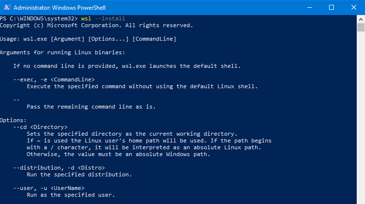
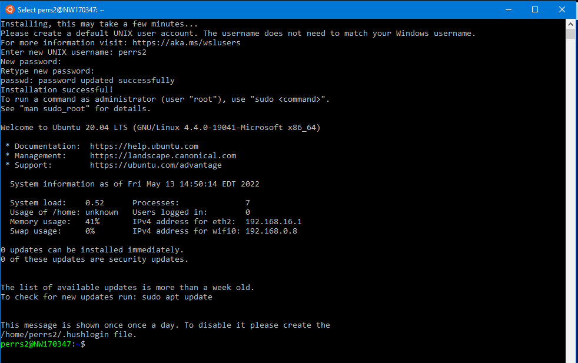

# Environment setup

Prior to starting this Command Line Training, choose an option below to setup your environment.

## Install Windows Subsystem for Linux (WSL)


WSL allows users to run a Linux environment directly on Windows. For more information, reference https://docs.microsoft.com/en-us/windows/wsl/

1. To install WSL on your machine, open a powershell prompt (as admin) and enter the following command:

```powershell
wsl --install
```
If the above command produces help text like the following: 



2. Run the wsl install command specifying a distribution:

```powershell
# list distributions available
wsl --list --online

# install wsl specifying a Ubuntu as the distribution
wsl --install -d Ubuntu
```

3. Once installation is complete, a new terminal should open and prompt you to create a username and password. 
You can use any simple username and password, just be sure to remember it.  It will be different than your nwie(nationwide) user and password.




Reference Microsoft's documentation for more details on this process - https://docs.microsoft.com/en-us/windows/wsl/install   

## Copy Exercise Files to be used for LinkedIn learning Video Training

1. Right click on the following github link and open it in a new tab: (https://github.com/LinkedInLearning/learning-linux-command-line-3005201) 
2. Go to that tab with the Github link and  click on the green **"CODE"** and then click **"Download Zip"**.  See picture below for what to click for reference:  
  

3. This should download a zip file called **"learning-linux-command-line-3005201-main"**.  After it downloads go to your Downloads folder and open it. In Windows, if you double click it, it should open it up.  Inside is a folder also called **"learning-linux-command-line-3005201-main"**. Double click into this folder and you should see a folder called **"Exercise Files"**.  Right Click on the **"Exercise Files"** folder and copy it.   


4. After copying the **Exercise Files**, go to your C drive and paste it into your **"tmp"** folder.  If you don't have a folder named **tmp**, then create it and then paste the Exercise Files into that **tmp** folder:  


5.  Now we need to copy these files into your WSL 2 (linux) environment to make your environment more closely match what you'll see in the video training.  Go to the Ubuntu terminal and make sure you are in your home directory by running: `cd ~` 
6.  Now that you are in your home directory, let's create a folder called **Documents** with this command: `mkdir Documents`
7.  Now copy the **Exercise Files** folder into this documents folder with this command:  `cp -R /mnt/c/tmp/Exercise\ Files/ ~/Documents`
8.  Here's a screenshot showing the commands mentioned above to create the Documents folder and copy the Exercise Files over:  

9. You are now ready to begin Command Line Training!
