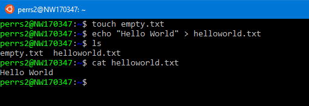
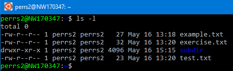
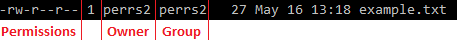
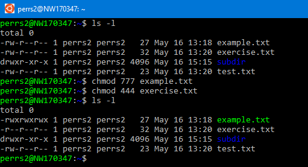
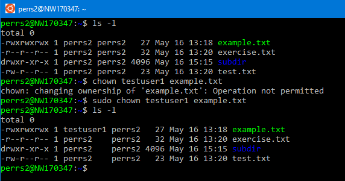
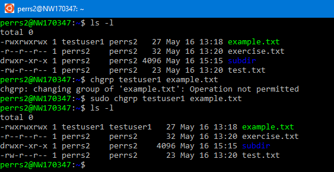

# Exercise 1: File manipulation

This exercise will cover basic file manipulation with bash. To begin this exercise, start in any directory on your linux system where you have privileges to create files and directories. The `/home/<user>` directory is recommended. 

If you do not have a true bash environment to work with, see the [environment setup](./environment-setup.md) page. 

## Creating files

To create an empty file, use the `touch` command.

```bash
# create an empty file
touch empty.txt
```

You can also redirect output into a file.

```bash
# echo a string and redirect the output into a new file if it does not exist
echo "Hello World" > helloworld.txt
```

Verify using `ls` to list the files in a directory and `cat` to print the contents of a file.



## Deleting files

Use `rm` to delete a file

```bash
rm empty.txt
```

List multiple files after `rm` to delete more than one file at a time

```bash
# create 3 empty files
touch 1.txt
touch 2.txt
touch 3.txt

# delete 2 of them with one command
rm 1.txt 2.txt
```

To delete all files in a directory, use the wildcard symbol `*`

```bash
rm *
```

## Copying and Moving files

Use `cp` to copy a file. You will need to provide the source and destination as parameters.

```bash
# Create a file to copy
touch cp-test.txt

# Copy cp-test.txt into copied.txt
cp cp-test.txt copied.txt

# Verify with ls, should see 2 files
ls

# Clean up
rm *
```

To move a file, we use the `mv` command.

```bash
# Create a file to move
touch mv-test.txt

# Move mv-test.txt into moved.txt
mv mv-test.txt moved.txt

# Verify with ls, should only see moved.txt now
ls

# Clean up
rm *
```

## Searching by file name

If you've run every command above, you should now have an empty home directory other than the "Documents" folder. Confirm with the 'ls' command.

To demonstrate searching for files by name, create a few files:

```bash
touch test.txt
touch example.txt
touch exercise.txt
```

We can now use the `find` command to search for a file by name:

```bash
# use the -name option should only return 1 result
find -name 'test.txt'
```

Or to search for files matching an expression:

```bash
# should return 2 results
find -name 'ex*'
```

The `find` command will search subdirectories as well:

```bash
# setup sub-directory with a file
mkdir subdir
touch subdir/external.txt

# should now return 3 results
find -name 'ex*'
```

## Searching within files

Search for content within files using the `grep` command.  

```bash
# add text to files 
echo "This is an example, Johnny" > example.txt
echo "Command Line Exercises are fun!" > exercise.txt
echo "Test your code, Johnny" > test.txt

# search for the string 'Johnny'. Be sure to specify to a path or location - ./* is equivalent to 'all files in this directory'
grep 'Johnny' ./*
```

## Editing file ownership and permissions

It is important for files and folders to have the correct security permissions to prevent unwanted access. To view current permissions and ownership in a directory, use the `ls -l` command



Looking at an individual file, its permissions and user/group ownership is as follows:



- **Permissions:** The level of access for owner, group, and others. Access is defined as read, write, and executable. See https://en.wikipedia.org/wiki/File-system_permissions#Notation_of_traditional_Unix_permissions for more detailed information.

- **Owner:** The owner of the file

- **Group:** The group that the file belongs to

### Update file permissions
***
Use the `chmod` command to update file permissions

```bash
# give full read/write/execute permissions for owner/group/others to example.txt
chmod 777 example.txt

# give read only access to owner/group/others to exercise.txt
chmod 444 exercise.txt
```



### Update file owner

Use the `chown` command to update the owner of the file:

```bash
chown <user> example.txt

# if Operation not permitted error is seen, try using sudo
# sudo chown <user> example.txt
```



### Update file group

Use the `chgrp` command to update the group that the file belongs to:

```bash
chgrp <group> example.txt

# if Operation not permitted error is seen, try using sudo
# sudo chgrp <group> example.txt
```


