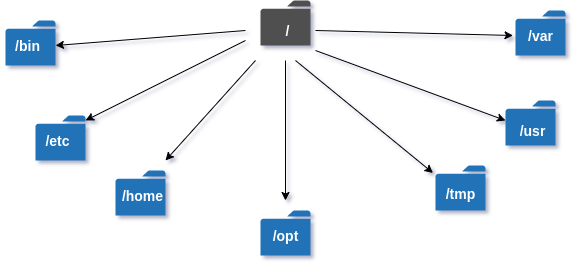
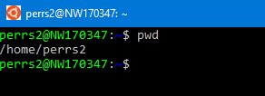

# Exercise 2: Navigating the file system

This exercise will cover basic file system navigation. We will also look at some of the standard files and folders found in a Linux operating system.

If you do not have a true bash environment to work with, see the [environment setup](./environment-setup.md) page.

## Linux directory structure

In Linux, operating system files are stored in a tree-like structure starting from the root directory: `/`

|  |
|:--:|
| *Image credit: https://www.geeksforgeeks.org/linux-directory-structure/* |

Some of the standard folders contained in the root directory are:

- `/bin` - Command binaries
- `/boot` - Boot loader files
- `/dev` - Device Files
- `/etc` - System Configuration Files
- `/home` - User personal data
- `/lib` - Shared libraries
- `/mnt` - Mount directory
- `/sys` - Information on devices, drivers, kernel features 
- `/tmp` - Temporary files
- `/usr` - User binaries and program data

Be aware that different distributions of Linux will have different folders in their root. For a complete list and detailed descriptions of standard Linux folders, see the following:
- https://linuxhandbook.com/linux-directory-structure/
- https://www.geeksforgeeks.org/linux-directory-structure/
- https://en.wikipedia.org/wiki/Filesystem_Hierarchy_Standard

## Navigation and inspection

Navigating the Linux directory structure is done by using the following core commands:

- `pwd` - Print the name of the current working directory
- `cd` - Change Directory
- `ls` - List (files and directories)

Not sure where you are in the file system? Use `pwd` to find out



The above image tells me that I'm in my users directory in /home. *Note: If you're following along using the RHEL docker image, you won't have a users directory and may start at root.*

Try completing the 3 problems below using the commands you've learned so far!

### __Problem 1:__ 

Change to the `/mnt` directory. Then verify that you're in the correct location.

<details><summary>Answer</summary>

```bash
# Change directory to /mnt
cd /mnt

# Print current directory to verify
pwd
```

</details>


### __Problem 2:__ 

The `cd` command can also be used to navigate to a path relative to the current location. 

After completing Problem 1, you should be in the `/mnt` directory. If we wanted to go to 'up' a single directory (back to root), what command could we use?

*Hint:*
- `.` represents the current directory
- `..` represents the directory one level up

<details><summary>Answer</summary>

```bash
# Change directory to the directory one level up
cd ..

# Print current directory to verify
pwd

# Or more explicitly. This is useful when you're many levels deep into a directory tree and wish to go back to root
cd /
```

</details>

### __Problem 3:__

Which commands would you use to accomplish the following in order? *Need a refresher on file manipulation? Review [exercise-1](./exercise-1-file-manipulation.md)*

1. Go to the `/tmp` directory 
2. Create a directory called `problem3`
3. Go into the `problem3` directory and create a file called `testFile1.txt`
4. Create a directory called `subDir`
5. Go into the `subDir` directory and create a file called `testFile2.txt`
6. Go up 1 level from the current directory
7. Move `testFile1.txt` into `subDir`
8. Check `subDir` and confirm both files are there

<details><summary>Answer</summary>

```bash
# 1. Go to the `/tmp` directory 
cd /tmp

# 2. Create a directory called `problem3`
mkdir problem3

# 3. Go into the `problem3` directory and create a file called `testFile1.txt`
cd problem3
touch testFile1.txt

# 4. Create a directory called `subDir`
mkdir subDir

# 5. Go into the `subDir` directory and create a file called `testFile2.txt`
cd subDir
touch testFile2.txt

# 6. Go up 1 level from the current directory
cd ..

# 7. Move `testFile1.txt` into `subDir`
mv testFile1.txt subDir

# 8. Check `subDir` and confirm both files are there
cd subDir
ls
# Or
ls subDir
```

</details>
