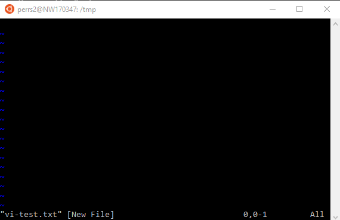
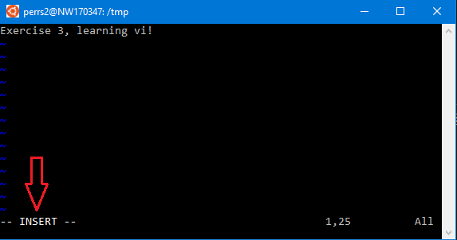
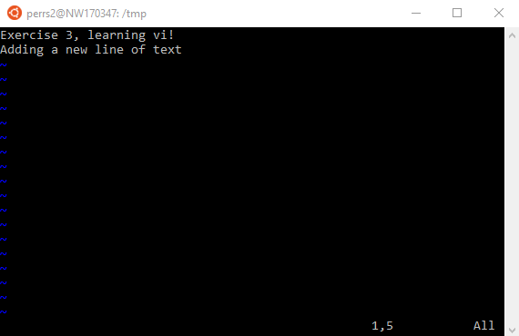
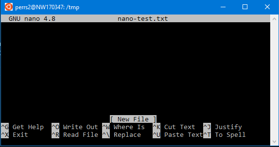

# Exercise 3: Command Line Editors

This exercise will introduce command line text editors typically found in Linux distributions. Learning how to use these editors is important as it may be the only (or most convenient) method to update text-based files. If you do not have a true bash environment to work with, see the [environment setup](./environment-setup.md) page.

## __Vi__

Vi is a common, powerful text editor included in most Linux distributions. To begin, navigate to a folder that you have permission to create and edit files (`/tmp` for example). 

Let's start working on a new file called `vi-test.txt`. Run the following in the terminal

```bash
vi vi-test.txt
```

You should see something like the following in your terminal:



Making any change to a document first requires the user to enter a command to activate a function. There are also commands to move the cursor, save/exit files, etc. 

The following resource is one of the many cheat sheets available on the web, keep it bookmarked until you become a master of vi! https://docs.oracle.com/cd/E19253-01/806-7612/editorvi-tbl-83/index.html.

Below are a few common actions you'll likely need to make minor edits to files.  

### __Inserting characters (right of the cursor)__ 

To add text to this new file, type `a` followed by some text. A good indicator that you have a command activated is in the bottom left hand corner of the terminal. Notice the `--INSERT--` indicator after typing `a` to activate text insertion. 



When you are done, hit the `Esc` key to stop inserting characters. The `--INSERT--` indicator should disappear.

### __Insert line (below the cursor)__

Let's now add a new line. While you could use the same insert command `a` and hit the `Enter` key, another way is to use the `o` command. This will insert a new line under the cursor and allow you to start entering text. Do that now and when done, hit the `Esc` key to stop inserting characters.

You should now see something like the following:




### __Saving__

There are a couple ways to save. Type `:w` to save changes (and keep vi open). `ZZ` or `:wq` saves changes and exits vi. `:q!` exits vi without saving.

Use `:w` for now as we want to demonstrate two more things before closing the editor.

### __Delete__

Deleting a single character (at the cursor) is done using the `x` command.

To delete an entire line (at the cursor), `dd`. 

### __Undo__

If you mistakenly delete or insert text that you need to undo, use the `u` command to undo everything from the previous command. 

The commands covered above are only a few of all available vi commands. Try to familiarize yourself with other basic commands and make sure to keep your cheat sheet handy!

## __Vi Exercise__

1. Use vi to create and edit a new file named "best_movies.txt"
2. Enter your top 5 favorite movies of all time each one on a different line with your favorite at the top.
3. Save your file and exit.
4. Re-open the file with vi and add how many times you've seen each movie at the end of each line. DO NOT USE THE ARROW KEYS to go to the end of the line.  
Example of what the file should look like after this step (with different values of course):
```
Red Dawn - 8
Tron - 5
Ground Hog Day - 3 
The Man Who Knew Too Little - 3
Patton - 3
```

5. Next save your file but don't close it.
6. Now delete the entire 3rd line without using the Delete or Backspace Key.
7. Copy your first line and paste at the end of the file.
8. Now exit without saving.
9. Reopen the file to make sure your file to make sure it looks the same as at the end of step 4.

## __Nano__

Nano is another option if your Linux distribution includes it (or you install it). Compared to vi, it is a more intuitive and simpler text editor to use. For example, there is no need to enter a command before adding text to the file and Ctrl-S is the shortcut used for saving!

Get started by typing the following in the terminal:

```bash
nano nano-test.txt
```

You should now see something like the following: 



Reference the following cheat sheet and try to replicate some of the simple commands done in the vi section above: https://www.nano-editor.org/dist/latest/cheatsheet.html
