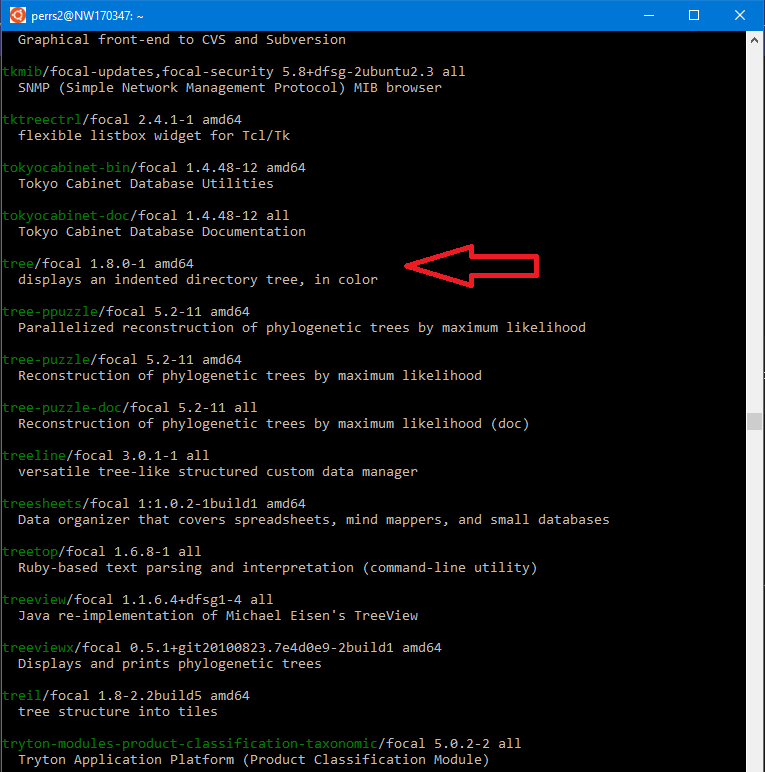
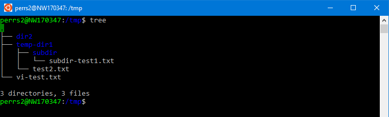
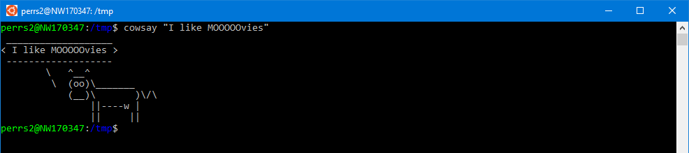
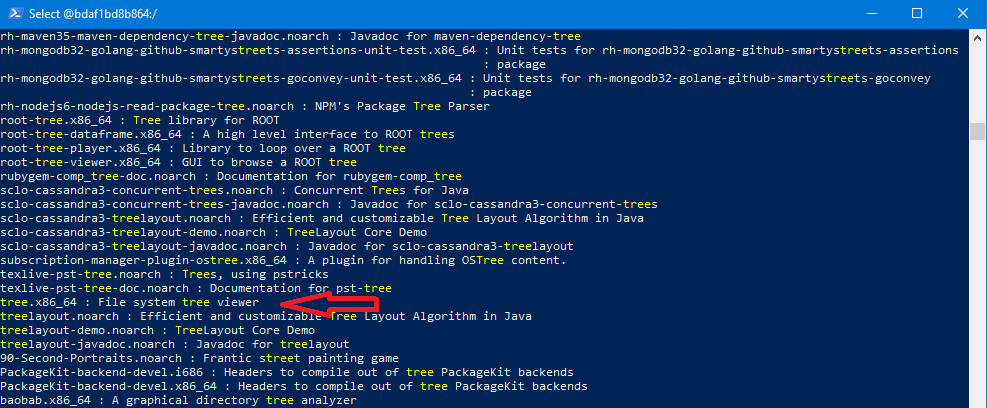
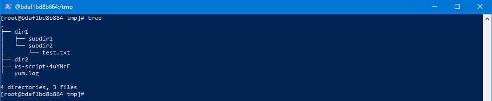
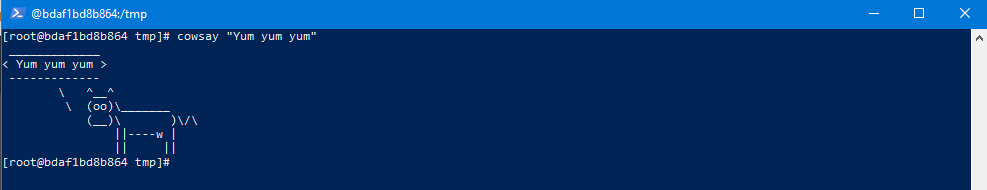

# Exercise 4: Package Managers

This exercise will cover how to install and update software with a package manager. Depending on which Linux distribution you're using, follow the Apt or Yum sections below to learn more about managing packages. If you do not have a true bash environment to work with, see the [environment setup](./environment-setup.md) page.


## Apt 

Advanced package tool (apt) will be the installed package manager if you're using Ubuntu or another Debian-based Linux distribution. To determine if your environment can use the apt package manager, enter the `apt` command in the terminal. If you see version information and a list of available commands, you should be able to follow the remainder of this section.

To begin with, run the `update` command to get an updated list of available packages from the repositories apt is configured to pull from. Do this each time before installing a package.

```bash
# update the list of available packages 
sudo apt update
```

Use `sudo` because the update command will be making system level updates.

### Search and install the 'tree' package

To demonstrate a practical use case, let's search for and install the `tree` package. 

Run the following command to search for packages with the term 'tree' in it.

```bash
# search for packages with the term 'tree' in it
apt search tree
```

You should see a long list as output. Scroll up and find the package we're looking for:



Verify the package to install by running the following commands:

```bash
# Displays detailed information for the tree package
apt show tree

# attempt to use the 'tree' command to make sure it's not already installed. Should see a 'tree' command not found error
tree
```

If the tree package is not already installed, run the the following command:

```bash
# install tree package
sudo apt install tree
```

If successful, try it out! From any directory, use the `tree` command to view the directory structure in a more user-friendly way.



### Upgrading packages

To upgrade every package installed, use the following command:

```bash
# determines every package that can be upgraded and prompts the user if they would like to continue
sudo apt upgrade
```

To upgrade a specific package, use the following command:

```bash
# replace <package-name> with the package to be upgraded
sudo apt install --only-upgrade <package-name>
```

### Removing packages

To remove a package from the system, we can use the `remove` command:

```bash
# replace <package-name> with the package to be removed
sudo apt remove <package-name>
```

### Search and install 'cowsay' package

Let's follow the same steps above to download another software package called `cowsay`.

First search for the package:

<details><summary>Step 1</summary>

```bash
# search for packages with the term 'cowsay' in it
apt search cowsay
```

</details>

Next, show information on `cowsay` and make sure it's not already installed:

<details><summary>Step 2</summary>

```bash
# Displays detailed information for the cowsay package
apt show cowsay

# attempt to use the 'cowsay' command to make sure it's not already installed. Should see a 'cowsay' command not found error
cowsay
```

</details>

Finally, install the package:

<details><summary>Step 3</summary>

```bash
# install the cowsay package
sudo apt install cowsay
```

</details>

Test it out! Use the cowsay command with any text 

```bash
cowsay "I like MOOOOOvies"
```



## Yum

Yum is another common package manager installed on Red hat and CentOS Linux distributions. It is similar in usage with apt.

__Note:__ If not running as root or a user with sufficient privileges, run the commands below with `sudo` 
### Search and install 'tree' package

There isn't a yum equivalent to the `apt update` command to pull in updates from repositories, so we can start by searching for the package we would like to install.

```bash
# search for packages with the term 'tree' in it
yum search tree
```

Scroll through the output and make sure the package we're looking for is available



Verify the package to install by running the following commands:

```bash
# Displays detailed information for the tree package
yum info tree

# attempt to use the 'tree' command to make sure it's not already installed. Should see a 'tree' command not found error
tree
```

If the tree package is not already installed, run the the following command:

```bash
# install tree package 
yum install tree
```

You will be prompted to verify installation - type 'Y' to confirm. 

If successful, try it out! From any directory, use the `tree` command to view the directory structure in a more user-friendly way.



### Upgrading packages

To upgrade every package installed, use the following command:

```bash
# determines every package that can be upgraded and prompts the user if they would like to continue
yum update
```

To upgrade a specific package, use the following command:

```bash
# replace <package-name> with the package to be upgraded
yum update <package-name>
```

### Removing packages

To remove a package from the system, we can use the `remove` command:

```bash
# replace <package-name> with the package to be removed
yum remove <package-name>
```

### Search and install 'cowsay' package with yum

Let's follow the same steps above to download another software package called `cowsay`.

First search for the package:

<details><summary>Step 1</summary>

```bash
# search for packages with the term 'cowsay' in it
yum search cowsay
```

</details>

Next, show information on `cowsay` and make sure it's not already installed:

<details><summary>Step 2</summary>

```bash
# Displays detailed information for the cowsay package
yum info cowsay

# attempt to use the 'cowsay' command to make sure it's not already installed. Should see a 'cowsay' command not found error
cowsay
```

</details>

Finally, install the package:

<details><summary>Step 3</summary>

```bash
# install the cowsay package
yum install cowsay
```

</details>

Test it out! Use the cowsay command with any text 

```bash
cowsay "Yum yum yum"
```

