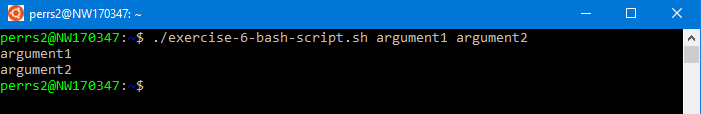
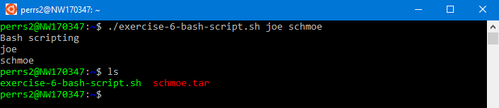
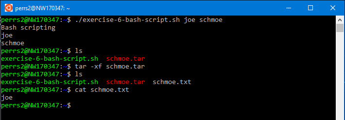

## Bash scripts

This exercise covers bash scripting. The [script](../scripts/exercise-6-bash-script.sh) we'll be building can be found in the scripts directory of this repository if you need a reference. 

If you do not have a true bash environment to work with, see the [environment setup](./environment-setup.md) page.

### Create the script

Start by creating a new file with the `touch` command. The file extension with be .sh as it's a shell script. 

```bash
touch exercise-6-bash-script.sh
```

Now open the script with vi or nano. Usage of these editors is covered in [exercise 3](./exercise-3-editors.md). This will be good practice getting used to the editor of your choice :smiley:

The first line we'll want to add is the following:

```bash
#!/bin/bash
```

This tells the system to run the script using bash. 

### Script arguments

Oftentimes we'll want to pass arguments to our scripts when invoking them. This allows our scripts to be dynamic in how they work. For this example, we'll allow the script to accept exactly 2 arguments. To do this, we'll use if/then/else logic. 

Add the following to the script:

```bash
if test $# -ne 2 
then
    echo "Requires 2 arguments! Exiting"
    exit 2
else
    # assign arguments to variables
    variable1=$1;
    variable2=$2;
fi

echo $variable1
echo $variable2

```

The if statement on the first line uses the `test` command to determine if the number of arguments ($#) passed into the script is not equal (-ne) to 2. `fi` closes the if block and the 2 echo statements will print out the variables we've assigned the passed-in arguments to.

### Executing the script

To execute the script, run the following command within the same directory as your script:

```bash
./exercise-6-bash-script.sh argument1 argument2
```

At this point, you should see something like this (depending on your arguments)



Now try executing the script with 0, 1, and 3 arguments. Do you see the "Requires 2 arguments! Exiting" as expected?

### Create a file and archive

Next, we'll add some commands to the script to create a file, archive it using the `tar` command, then clean up the original file. Add the following commands to the script:

```bash
# Create a variable for the filename using the 2nd argument passed in. Then create the file containing the text from the first argument
fileName="$variable2".txt
echo $variable1 > $fileName
```

Test the script again running the same command:

```bash
./exercise-6-bash-script.sh joe schmoe
```

Use the `cat` command to verify that the file (schmoe.txt) contains the first argument (joe)

```bash
cat schmoe.txt
```

### Archiving the file

Let's make the script a little more interesting by having it archive the file using the `tar` command. Add the following to the bottom of the script:

```bash
# Archive the file using 'tar'
tar -c -f "$variable2".tar $fileName

# Clean up original file
rm $fileName
```

Test the script again running the same command:

```bash
./exercise-6-bash-script.sh joe schmoe
```

We should now see a tarfile named argument2.tar. Check with the `ls` command.



We can't use the `cat` command to verify the archive file contains the original. To do this, we can extract the contents of the file using the same `tar` command:

```bash
tar -xf schmoe.tar
```

Now do an `ls` and `cat` on schmoe.txt



Congratulations!! You've created a bash script!